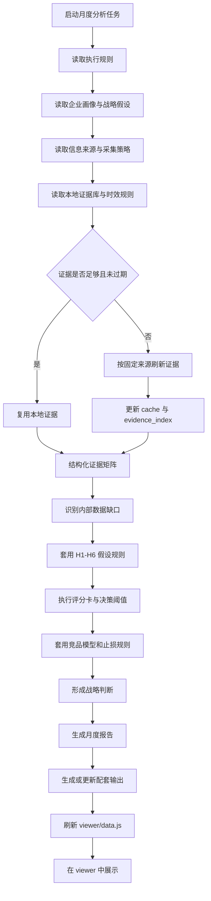
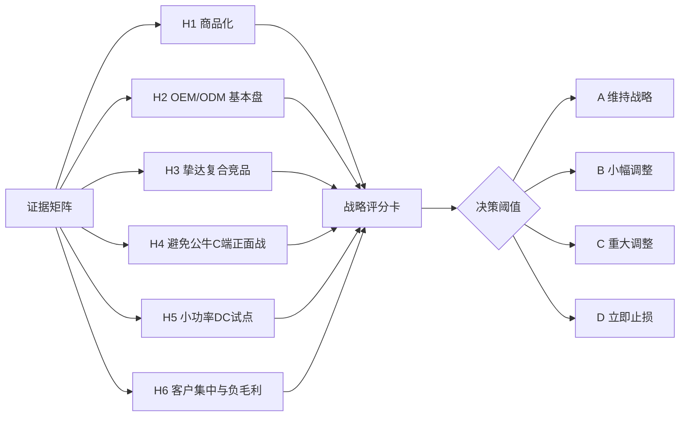
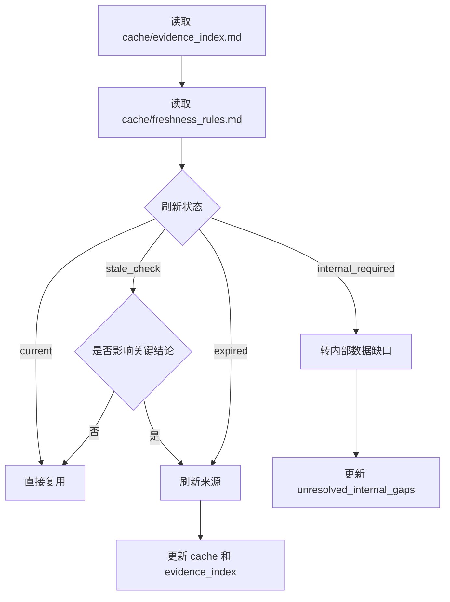
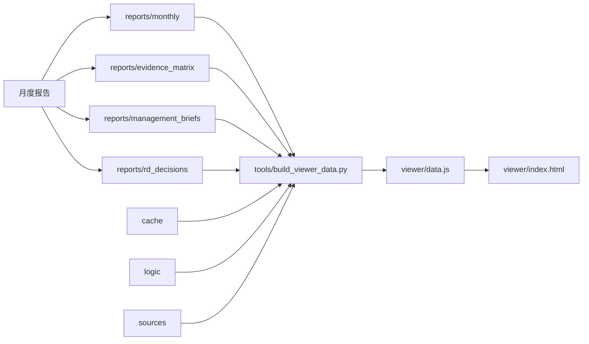

# 月度战略分析报告执行流程

本文描述执行一次“月度小功率充电桩战略复盘报告”的完整流程，并标注每一步依赖的策略、规则和数据文件。

## 1. 总体流程图



## 2. 步骤与文件映射

| 步骤 | 目的 | 主要文件 |
|---|---|---|
| 启动月度分析任务 | 选择月度复盘模式，生成报告骨架 | `tools/strategy_monitor_menu.py` |
| 读取执行规则 | 明确必须读哪些输入、缓存、逻辑和模板 | `strategy-monitor/SKILL.md`、`strategy-monitor/prompts/strategy-monitor.md` |
| 读取企业画像 | 明确我方业务、优势、短板和风险 | `strategy-monitor/inputs/company_profile.md` |
| 读取战略假设 | 确定 H1-H6 要验证什么 | `strategy-monitor/inputs/strategic_assumptions.md` |
| 读取判断阈值 | 把假设从定性转为可判定条件 | `strategy-monitor/inputs/strategic_thresholds.md` |
| 读取竞品清单 | 确定重点跟踪对象和战略问题 | `strategy-monitor/inputs/competitor_watchlist.md` |
| 读取来源策略 | 确定来源等级和证据使用边界 | `strategy-monitor/inputs/source_policy.md` |
| 读取固定来源 | 确定优先检索入口 | `sources/source_registry.md` |
| 读取检索问题 | 确定每类对象要回答的问题 | `sources/search_playbook.md` |
| 读取采集任务 | 明确市场、竞品、政策、招投标采集周期 | `sources/market_sources.md`、`sources/competitor_sources.md`、`sources/policy_sources.md`、`sources/tender_sources.md` |
| 读取证据索引 | 查找已有本地证据 | `cache/evidence_index.md` |
| 判断证据时效 | 判断 current、stale_check、expired、internal_required | `cache/freshness_rules.md` |
| 读取证据正文 | 复用已沉淀的市场、政策、竞品、客户和产品证据 | `cache/market_policy/`、`cache/competitors/`、`cache/customers/`、`cache/product_strategy/` |
| 刷新外部证据 | 只刷新缺失、过期或影响决策的证据 | `sources/*` 规定的固定来源 |
| 更新证据库 | 将可复用新证据追加到本地 | `cache/**/*.md`、`cache/evidence_index.md` |
| 识别内部缺口 | 防止把公开信息误判为内部经营事实 | `cache/unresolved_internal_gaps.md`、`strategy-monitor/inputs/internal_data_requirements.md`、`strategy-monitor/inputs/internal_data_template.md` |
| 套用假设规则 | 判断 H1-H6 状态 | `logic/hypothesis_rules.md` |
| 执行评分卡 | 计算调整压力 | `logic/scorecard_rules.md`、`strategy-monitor/templates/strategy_scorecard.md` |
| 执行决策阈值 | 判断 A/B/C/D 战略等级 | `logic/decision_thresholds.md` |
| 执行止损规则 | 判断是否触发项目冻结、止损或红线 | `logic/stop_loss_rules.md` |
| 套用竞品模型 | 对挚达、公牛、科大智能等形成差异化判断 | `logic/competitor_models/*.md`、`strategy-monitor/inputs/zhida_risk_model.md` |
| 生成月度报告 | 输出完整月度复盘 | `strategy-monitor/templates/monthly_report_template.md`、`reports/monthly/` |
| 生成配套输出 | 根据需要生成证据矩阵、简报、研发决策等 | `strategy-monitor/templates/evidence_matrix.md`、`one_page_strategy_brief.md`、`rd_resource_decision.md` |
| 刷新展示数据 | 将报告、证据、逻辑和缺口聚合到 viewer | `tools/build_viewer_data.py`、`viewer/data.js` |
| 本地展示 | 在战略工作台查看总览、报告、证据、竞品、缺口 | `viewer/index.html` |

## 3. 月度报告核心判断链



对应文件：

- H1-H6 定义：`strategy-monitor/inputs/strategic_assumptions.md`
- H1-H6 阈值：`strategy-monitor/inputs/strategic_thresholds.md`
- 假设规则：`logic/hypothesis_rules.md`
- 评分规则：`logic/scorecard_rules.md`
- 决策阈值：`logic/decision_thresholds.md`
- 止损规则：`logic/stop_loss_rules.md`

## 4. 证据刷新策略



对应文件：

- 证据索引：`cache/evidence_index.md`
- 时效规则：`cache/freshness_rules.md`
- 内部缺口：`cache/unresolved_internal_gaps.md`
- 来源入口：`sources/source_registry.md`
- 检索问题：`sources/search_playbook.md`

## 5. 输出与展示链路



## 6. 月度执行命令

生成月度报告骨架：

```bash
python3 tools/strategy_monitor_menu.py --choice 1 --date YYYY-MM-DD
```

报告完成后刷新本地展示：

```bash
python3 tools/build_viewer_data.py
```

基础校验：

```bash
python3 -m py_compile tools/*.py
node --check viewer/app.js
```
